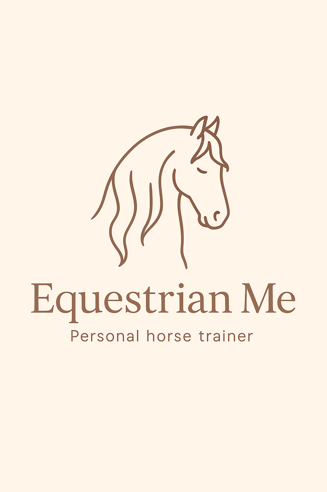

# 🐎 Equestrian Me

An interactive web application featuring a personalized GPT chat assistant tailored for horse enthusiasts. The app uses OpenAI API to provide helpful, context-aware conversations about equestrian topics, training tips, and horse care.

---

## 📷 Logo

  

---

## 🛠 Technologies and tools

- Python 🐍  
- Streamlit  
- OpenAI API  
- Pandas (for data handling)  

---

## 🚀 Skills demonstrated in this project

- integration with OpenAI API for conversational AI  
- building personalized chatbot experiences  
- handling user input and managing conversation context  
- developing interactive web apps with Streamlit  
- managing and processing data for improved responses  
